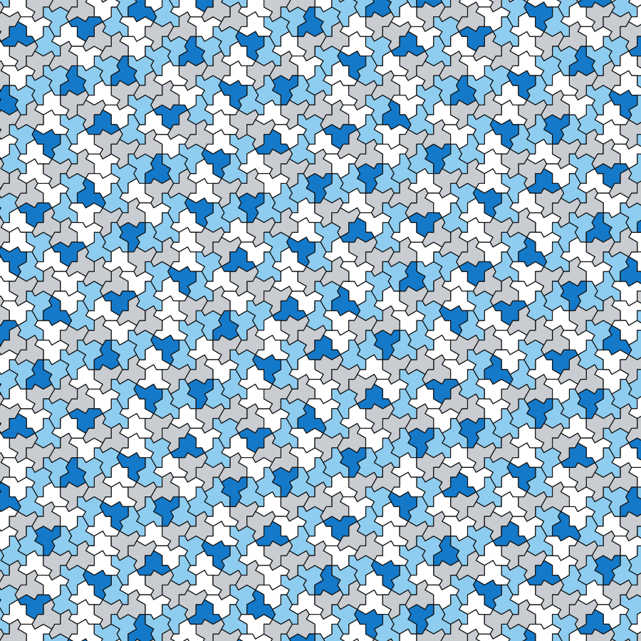
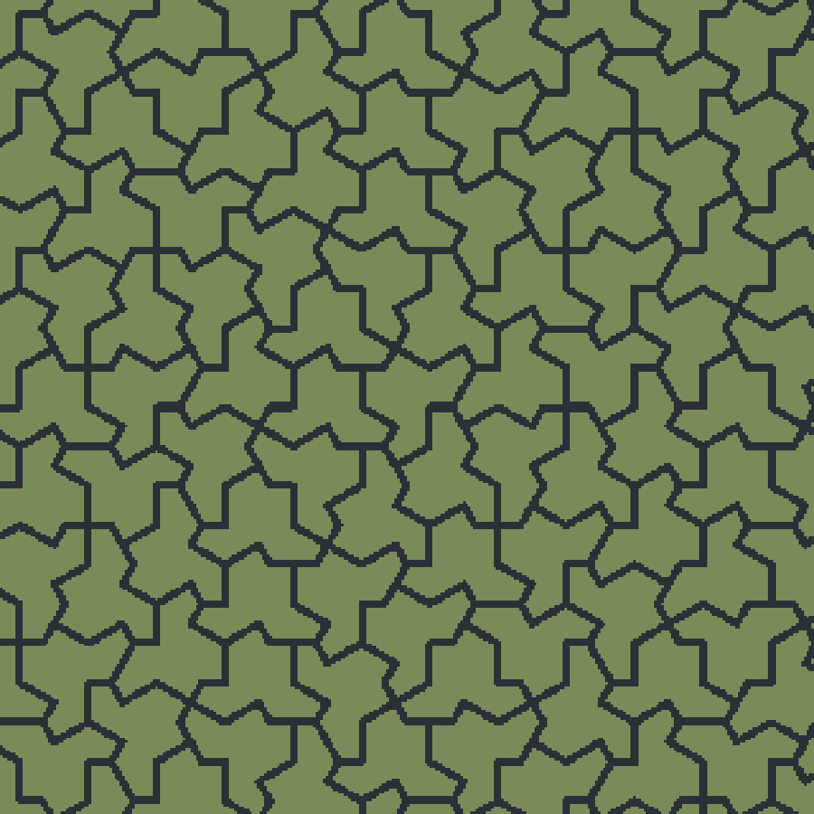

# Hattorio

**A Factorio mod that replaces the square grid with an aperiodic one.**

Your factory is built on the "hat" monotile tiling — the aperiodic tiling
discovered in 2023. Cells never repeat, so neither can your blueprints.



> **Status: in development.** The tiling engine is finished and tested. The
> mod itself — terrain, build restrictions, settings — is not written yet.
> There is nothing to install from the mod portal today.

## What it does to your game

Each cell is a hat, separated from its neighbours by a narrow **unbuildable
band**. You can walk and drive across a band, and underground belts and
pipes tunnel beneath it, but nothing can be built on one.

That single rule changes how you build:

- **Imported blueprints stop working.** Not because of rotation — because
  every cell is a genuinely different shape. Over 1,156 cells measured at the
  default settings there are **624 distinct buildable tile shapes**, and no
  single one covers more than 1.1% of the map. A layout that fills one cell
  will not fit the next.
- **Small blueprints still travel.** Anything up to 18×18 at the default
  settings fits every cell. Assembler clusters are fine; a 30×30 mall is not.
- **Every connection between cells is a puzzle.** Belts cross by underground
  pair, against an edge that is never axis-aligned.

The result is a factory that has to be fitted to the ground it sits on.



## Settings

Per planet, set at world creation.

| Setting | Default | Choices |
|---|---|---|
| Cell size (centre to vertex, tiles) | **41** (normal) | 15, 26, 41, 52 |
| Band width (tiles) | **3** (wide) | 1, 2, 3, 4 |
| Band appearance | Dark liquid | liquid, void, glowing rift |

Hat size is the dial that matters. It decides how much room you get and how
large a blueprint survives:

| size | difficulty | cell area | reusable blueprint | preview |
|---|---|---|---|---|
| 15 | very hard | 116 t | ~5×5 | [look](docs/preview/bands-15-2.png) |
| 26 | hard | 347 t | 11×11 | [look](docs/preview/bands-26-2.png) |
| **41** | **normal** | **944 t** | **18×18** | [look](docs/preview/bands-41-3.png) |
| 52 | easy | 1,584 t | 23×23 | [look](docs/preview/bands-52-2.png) |

Changing the setting later affects only newly created surfaces; existing ones
keep the geometry their terrain was built with, so nothing ever seams.

## Why this is harder than it sounds

Factorio's grid is not a rendering choice — tiles, collision, belt lanes,
pipes and the pathfinder are all C++ and all assume axis-aligned 1×1 tiles.
No mod can make the unit of construction hat-shaped. What a mod *can* do is
decide where you may build, and that turns out to be enough.

Generating the tiling is the interesting part. It is aperiodic, so there is no
lattice to snap to and no period to exploit; the mod computes which hats
overlap a chunk by descending a substitution tree, pruned by bounding circle,
at about 0.7 ms per chunk.

If you like that sort of thing, the [wiki](../../wiki) has a write-up — how
the limiting metatiles were recovered as exact algebraic numbers, and why
plain doubles beat exact integer arithmetic by nine orders of magnitude.

## For developers

```
hat/         the tiling core — no Factorio dependencies, runs under plain Lua
tools/       offline pipeline (Python) that derives and verifies the rule data
data/        generated Lua data; never edit by hand
spec/        busted tests
docs/design/ the design spec, including everything that turned out wrong
```

Requires Lua 5.2 (the version Factorio embeds), busted and luacheck:

```bash
sudo pacman -S --needed lua52 lua52-busted luacheck   # Arch
make check          # Python + Lua tests + lint
make data           # regenerate data/ and test fixtures
lua5.2 tools/render.lua 5 12 340 out.svg              # draw the tiling
lua5.2 tools/render_bands.lua 26 2 260 bands.svg      # preview in-game look
```

The core is validated against a golden fixture exported from the Python
pipeline, which is itself checked for overlaps, gaps, correct reflected-hat
density, and hat counts matching F(2n+3)².

## Credits

The hat monotile was discovered by David Smith, Joseph Samuel Myers, Craig S.
Kaplan and Chaim Goodman-Strauss (2023). The substitution structure here is
derived from Kaplan's [hatviz](https://github.com/isohedral/hatviz)
(BSD-3-Clause) — see [THIRD_PARTY.md](THIRD_PARTY.md).

[Hextorio](https://github.com/sOvr9000/hextorio) solved several of the same
problems for hexagons first, and its approach to storing geometry per surface
is borrowed here.

MIT licensed.
